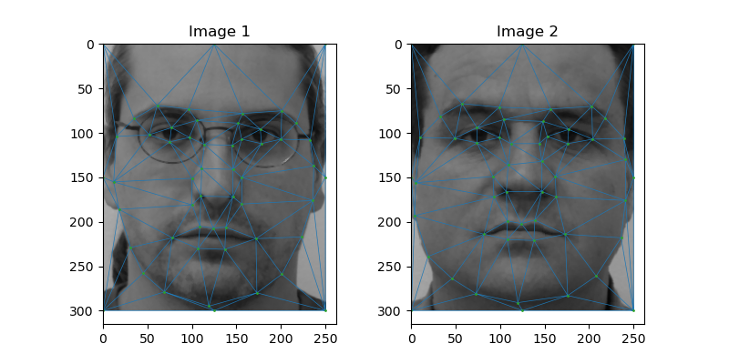
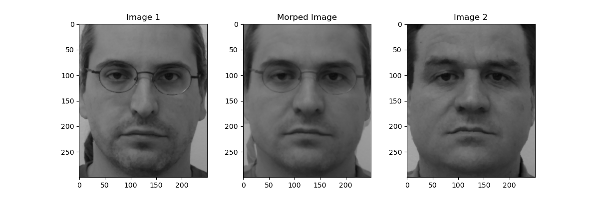
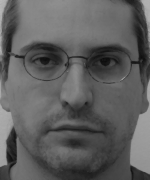
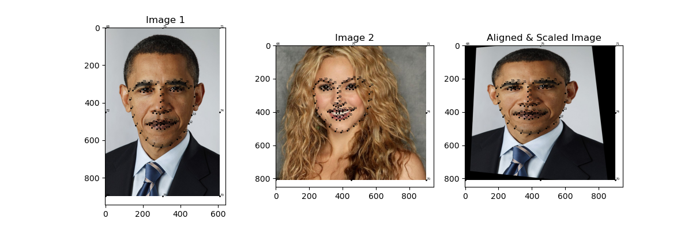
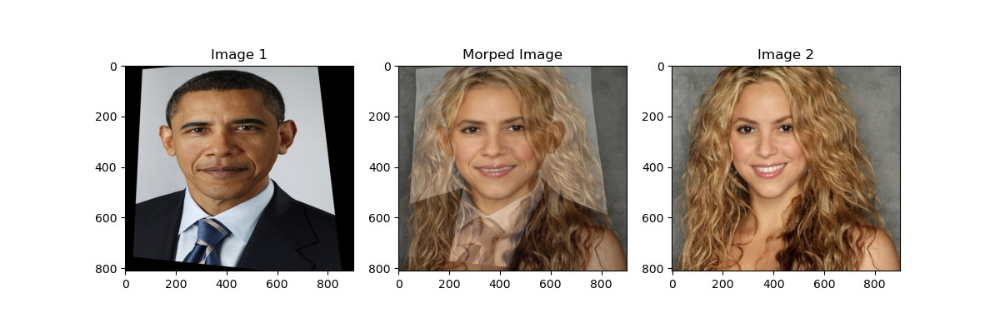
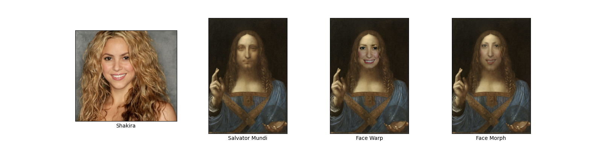
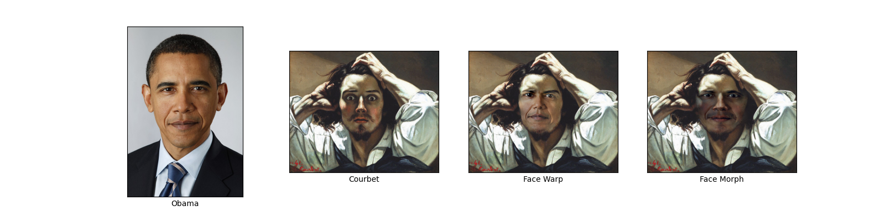
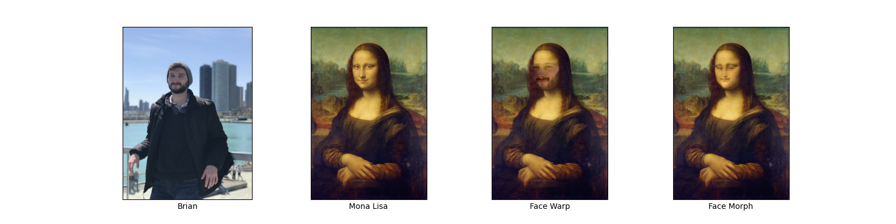
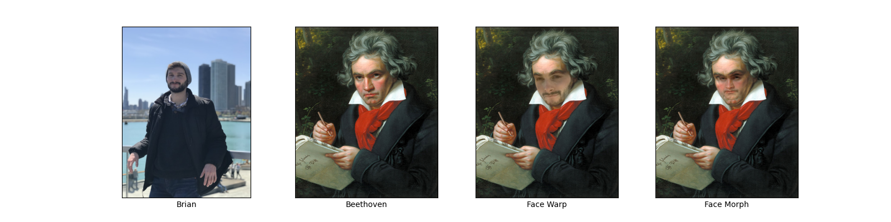
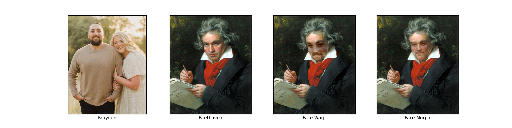

# Face Morph and Face Swap
This project represents my contributions to the group project [Portrait Face Swap with Face Detection & Style Transfer](./final_project.pdf), which developed a program to swap your face with the face in a famous portrait. My contribution focused on face morphing and swapping the faces. Other parts of the project included atutomatic face detection and a deep learning model for style transfer. 

## Table of Contents
1. [Face Morph](#face-morph)
1. [ Morphing on Annotated, Aligned Faces](#morphing-on-annotated-aligned-faces)
1. [Facial Keypoint Detection with DLIB and Automatic Alignment](#facial-keypoint-detection-with-dlib-and-automatic-alignment)
1. [Face Cutting, Blending, Face Swap](#face-cutting-blending-face-swap)   
1. [References and Acknowledgements](#references-and-acknowledgements)

# Face Morph
A morph is a simultaneous warp of the image shape and a cross-dissolve of the image colors, which natrually transforms one face into another. Below are the steps to perform a face morph: 
1. Scale and align face image relative to portrait's face
    1. Calculate a homography between the facial keypoints in the face image and the portrait
    1. Apply a perspective shift
1. Average the keypoints from both faces to create the average face
1. Compute the Delaunay triangulation for each set of keypoints
1. Find the affine transformations between the triangles in the face image and portrait with the average face’s triangles and warp them to the average face
1. Perform a cross-dissolve between the face image and portrait

[Back to top](#table-of-contents)
 
 

## Morphing on Annotated, Aligned Faces
The [FEI face database](https://fei.edu.br/~cet/facedatabase.html) is a Brazilian face database that contains a set of face images that have been normalized, equalized and cropped. In addition, 46 facial keypoints have been manually annotated. This data serves as an excellent base case to test the morphing process.  

### Delaunay Triangulation:

Since these images are the same size and are frontal shots, there is not need to scale and align the images. The Delaunay triangulation is calculated on each face image using the provided facial keypoints.

### Morph Two Faces:

The morphed image represents the halfway face, which is the average face between each face image. This is computed by averaging the facial keypoints in each face image, warping each face image to the average face, then doing a 50% cross-dissolve of each warped face.

### Morphing Process:
<!--  -->

The above gif naturally morphs image 1 to image 2.

### Morphing Several Faces:
<!--  -->

[Back to top](#table-of-contents)
 
 

## Facial Keypoint Detection with DLIB and Automatic Alignment
Facial keypoints are automatically detected using [DLIB](https://pyimagesearch.com/2017/04/03/facial-landmarks-dlib-opencv-python/). Then the first image is scaled and aligned relative to the second image by computing and homgraphy between the facial keypoints and then applying a perspective transform. Aligning the faces is essential when making a gif of the entire morphing process from the first image to the second image.

### Obama and Shakira:

Facial keypoints were detected using DLIB. The image of Obama was scaled and aligned relative to Shakira's face

#### Morphing Obama into Shakira:
<!--  -->
<!--  -->

### Morphing Faces into Portraits:
The next two examples demonstrate that DLIB can also detect facial keypoints in portraits. Then Obama's face can be transformed into a portrait.
<!--  -->

 

<!--  -->

[Back to top](#table-of-contents)
 
 

# Face Cutting, Blending, Face Swap
Face swap in this project extracts the face from an image and superimposes it on a famous portrait. Face swap is performed as follows:

1. Extract the face by calculating the convex hull of its facial keypoints to create a mask
1. Calculate the center of the convex hull of the portrait's facial keypoints to center the face onto the portrait
1. Optionally, perform color correction to scale each pixel by the ratio of pixel intensities between the portrait and the warped/morphed face across each color channel
1. Poisson blend the face into the portrait

Face swap is also tested by warping the face image directly onto the portrait in contrast to face morp where both faces are first tranformed to an intermediate face. This process is called face warp to distinguish it from face morph. The face warping process is defined below: 
1. Construct Delaunay triangulation for each face using their respective facial keypoints
1. Find the affine transformations between the triangles in the face image and the portrait
1. Warp each triangle of face image to the portrait

This method will produce a slight warping effect since the facial characteristics of the face image have to fit onto facial characteristics of the portrait.

In each example below, the first image of the panel is the face that will be superimposed onto the portrait. The second image is the portrait. The final two images are the final face swap using the two methods: face warp and face morph. 

Face warp generally produces the best results.  The main issue with face morph is that since the the faces are first transformed to an intermediate face, this intermediate face may not align well with the portrait's face. However, when there are not misalignment issues with face morph, it can produce an interesting effect as well as it helps blend the face into the portrait due to the cross-dissolve. 

### Shakira and Salvator:

### Obama and Courbet:

### Brian and Mona Lisa:

### Brian and Beethoven:

### Brayden and Beethoven:

[Back to top](#table-of-contents)
 
 

## References and Acknowledgements
- [Affine Transformations in OpenCV](https://docs.opencv.org/3.4/d4/d61/tutorial_warp_affine.html)

- [Delaunay Triangulation in Scipy](https://docs.scipy.org/doc/scipy/reference/generated/scipy.spatial.Delaunay.html)

- [Face Morph Using OpenCV](https://learnopencv.com/face-morph-using-opencv-cpp-python/)

- [Face Morphing Project Berkeley Assignment](https://inst.eecs.berkeley.edu/~cs194-26/fa22/hw/proj3/)

- [Facial landmarks with dlib, OpenCV, and Python](https://pyimagesearch.com/2017/04/03/facial-landmarks-dlib-opencv-python/)

- [Face Swap](https://github.com/wuhuikai/FaceSwap/blob/master/face_swap.py)

- [fillConvexPoly() in OpenCV](https://docs.opencv.org/4.x/d6/d6e/group__imgproc__draw.html#ga9bb982be9d641dc51edd5e8ae3624e1f)

- [Geometric Transformations of Images](https://docs.opencv.org/4.x/da/d6e/tutorial_py_geometric_transformations.html)

- [How to Create a GIF from Matplotlib Plots in Python](https://towardsdatascience.com/how-to-create-a-gif-from-matplotlib-plots-in-python-6bec6c0c952c)

- Images/Data:

    - [Obama](https://es.m.wikipedia.org/wiki/Archivo:Official_portrait_of_Barack_Obama-2.jpg)

    - [FEI Face Database](https://fei.edu.br/~cet/facedatabase.html)

    - [Portraits](https://www.wikiart.org/)

    - [Shakira](https://spanish.fansshare.com/gallery/photos/14548215/shakira-famous-hollywood-singer-face-wallpaper/?displaying)

[Back to top](#table-of-contents)
 
 